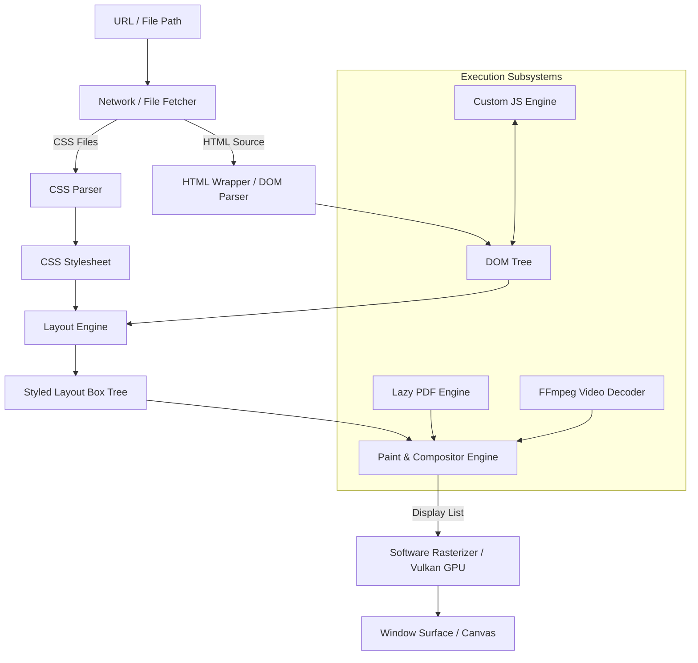

# DesktopWebview

DesktopWebview is a high-performance, custom-built toy desktop browser engine written in C++26. It features native windowing via X11 (Linux) and Win32 (Windows) APIs, Vulkan graphics integration, an uncompressed video player, dynamic page scrolling, a custom JavaScript interpretation engine, and a custom lazy PDF rendering engine built entirely from scratch.

---

## System Architecture

DesktopWebview is structured as a pipeline-based browser engine similar to modern rendering engines (like WebKit or Blink), but implemented with a custom software and hardware-accelerated pipeline.



### 1. Resource Ingestion & Fetching (`Net` & `Browser`)
- Handles fetching remote files via HTTP/HTTPS (using a custom socket layer built on OpenSSL) and local files via system path resolution.

### 2. DOM & Parser Layer (`Wrapper`)
- Parses HTML documents using a custom Wrapper over `libxml2` to build the **Document Object Model (DOM)** tree.
- Manages node hierarchies, attributes, and inner text mutations.

### 3. Styling Engine (`Css`)
- Parses CSS style rules (supporting margins, paddings, display, widths, heights, colors, and borders).
- Resolves cascades and matches selectors against DOM nodes to construct the **Styled Node Tree**.

### 4. Layout Engine (`Layout`)
- Translates the Styled Node Tree into a physical layout box hierarchy using block and inline formatting contexts.
- Resolves dimensions (margins, borders, padding, content widths/heights) and computes coordinates in page space.

### 5. Paint & Compositor Engine (`Paint` & `BaseWindow`)
- Converts layout boxes into a flat list of `DisplayCommand` drawings (SolidRects, borders, text runs, images, and videos).
- Composites media resources and handles blitting to a software `Canvas` or hardware Vulkan surface.
- Accelerated base64 and rendering processing using OpenCL kernels.

---

## Specialized Subsystems

### Custom JavaScript Engine (`JsEngine`)
- **Lexer & Parser**: Performs lexical tokenization and parses expressions/statements into Abstract Syntax Trees (AST).
- **Environment Scope**: Resolves execution frames, scoped variables, arithmetic operations, and string manipulations.
- **DOM Bridge**: Binds native C++ DOM manipulations (such as `console.log`, `document.title`, `document.getElementById`, and `innerText` updates) to JS runtime APIs.

### Optimized PDF Engine (`Documents` / `Pdf`)
- **Structural Parser**: Resolves low-level PDF dictionary structures, cross-reference (XRef) tables, and page catalogs.
- **Text Extraction Machine**: Decompresses page streams via zlib and feeds them to a spec-compliant stack interpreter (`ParseText` tracking `Tm`, `Td`, `Tf`, `TJ`, `Tj`, `'`, `"`), extracting text coordinates in PDF coordinate space.
- **Lazy On-Demand Renderer**:
  - Automatically queries MediaBox page sizes via `pdfPageSizes()` without allocating pixel memory.
  - Formats layout nodes with explicit size properties (`pdf://page/N`).
  - Evaluates viewport intersections at render-time, rendering pages on-demand and caching them to a paging map (`m_pdfPages`) to ensure stable memory consumption (~10-20MB instead of 7.5GB) and smooth 60 FPS scrolling.

### Media Decoding (`Video` & `Audio`)
- Parses raw uncompressed video formats (`.rawv`) and standard formats via FFmpeg.
- Synchronizes video playback using steady-clock timing and outputs PCM audio data via ALSA (Linux) or WASAPI (Windows) backends.

---

## Building and Running

### Linux Natively
This repository contains a Nix development shell setup (`shell.nix`) containing all necessary tooling and dependencies.

1. **Enter the Nix Shell**:
   ```bash
   nix-shell
   ```
2. **Build the Project**:
   ```bash
   build-linux
   ```
3. **Run the Browser**:
   ```bash
   run-linux
   ```
4. **Run Unit Tests**:
   ```bash
   run-test-linux
   ```

### Cross-Compiling for Windows
1. **Enter the Nix Shell** and configure cross-compilation:
   ```bash
   nix-shell --arg strSystem "x86_64-linux"
   ```
2. **Compile using the MinGW Toolchain**:
   ```bash
   build-windows
   ```

---

## Project Structure

* `include/` & `src/`: Core engine implementations (JsEngine, Network, Parser, CSS, Layout, Graphics presentation, PDF parsing, Video/Audio playback).
* `test/`: Native unit testing targets verifying JS interpretation, networking, rendering, and PDF stream interpreters.
* `assets/`: Default user-agent styles and preloaded page resources.

---

## License
MIT License — © 2026 Hylmi